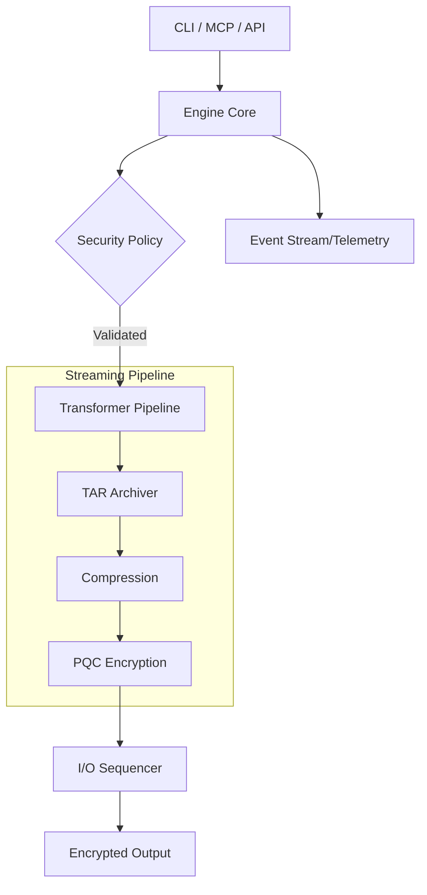

# Maknoon (مكنون)
> **Enterprise-Grade Post-Quantum Encryption and Identity Management**

[](https://github.com/al-Zamakhshari/maknoon/releases)
[](https://opensource.org/licenses/MIT)
[](https://goreportcard.com/report/github.com/al-Zamakhshari/maknoon)

## Executive Summary
Maknoon is a high-performance cryptographic engine and Model Context Protocol (MCP) server designed to secure data against classical and quantum computational threats. By implementing NIST-standardized Post-Quantum Cryptography (PQC) within a constant-memory streaming architecture, Maknoon provides a scalable solution for securing sensitive assets in both automated pipelines and interactive environments.

---

## Capabilities

| Feature | Technical Specification |
| :--- | :--- |
| **Asymmetric Encryption** | Hybrid HPKE (RFC 9180) utilizing ML-KEM-1024 (Kyber) and X25519. |
| **Digital Signatures** | ML-DSA-87 (Dilithium) for high-integrity provenance. |
| **Symmetric Cipher** | XChaCha20-Poly1305 AEAD with 192-bit nonces. |
| **Key Derivation** | Argon2id with configurable time, memory, and parallelism parameters. |
| **Streaming Engine** | 64KB chunked pipeline ensuring $O(1)$ memory complexity. |
| **Secret Sharing** | M-of-N Shamir’s Secret Sharing over $GF(2^8)$ for identity recovery. |
| **Stealth Mode** | Removal of header magic bytes for cryptographic indistinguishability. |

---

## Installation

### Homebrew (macOS/Linux)
```bash
brew tap al-Zamakhshari/tap
brew install maknoon
```

### From Source
```bash
git clone https://github.com/al-Zamakhshari/maknoon
cd maknoon
go build -o maknoon ./cmd/maknoon
```

### AI Agent Extension
```bash
gemini-cli extension install https://github.com/al-Zamakhshari/maknoon --path extensions/maknoon-extension
```

---

## Core Usage

### 1. Identity Management
Generate and manage PQC identities. Maknoon supports multiple security profiles (e.g., `v3` for standard hybrid lattice, `conservative` for non-lattice fallbacks).
```bash
# Generate a new PQC identity
maknoon keygen -o primary_id --profile v3

# List local identities
maknoon identity list
```

### 2. Encryption and Decryption
Encryption supports multiple recipients. The engine orchestrates archival and compression middleware before applying the cryptographic layer.
```bash
# Encrypt for multiple recipients
maknoon encrypt document.pdf -p recipient_a.pub -p recipient_b.pub

# Decrypt using a private identity
maknoon decrypt document.pdf.makn -i primary_id -o document.pdf
```

### 3. Password and Secret Vault
Manage credentials in a quantum-resistant vault, utilizing authenticated encryption for local storage.
```bash
# Store a credential
maknoon vault set database.prod --user admin

# Retrieve a credential
maknoon vault get database.prod
```

---

## Enterprise Integrations

### Model Context Protocol (MCP)
Maknoon includes a native MCP server implementation, allowing AI agents (e.g., Claude, Cursor) to interact with the cryptographic engine within a governed security sandbox.

| Tool | Functionality |
| :--- | :--- |
| `inspect_file` | Analyzes header metadata and signature validity without decryption. |
| `encrypt_file` | Protects local files using specified PQC public keys. |
| `vault_get` | Retrieves managed secrets via the engine's authenticated interface. |
| `identity_active` | Queries the host's active cryptographic profiles and public keys. |

### Audit and Compliance
For organizational accountability, Maknoon supports pluggable audit decorators that record structured metadata for all cryptographic operations.

```bash
# Enable structured JSON auditing
maknoon config set audit.enabled true
```

> **Security Compliance:** Audit logs are disabled by default. When enabled, the engine masks PII (e.g., home directory paths) in log outputs to ensure compliance with privacy regulations.

---

## Architecture

Maknoon implements the **Policy Provider** and **Decorator** patterns to decouple security logic from implementation.



### Constant-Memory Streaming
The architecture utilizes a **Sequencer Model** where input streams are divided into 64KB blocks. These blocks are processed in parallel by a worker pool and reassembled by the sequencer, maintaining a stable memory footprint regardless of file size.

### Deterministic Memory Hygiene
All sensitive cryptographic material, including File Encryption Keys (FEKs) and private key shards, are stored in specialized memory buffers. These buffers are explicitly zeroed out using `SafeClear` patterns immediately upon completion of the operation to mitigate memory-scraping risks.

---

## License
This project is licensed under the MIT License.
