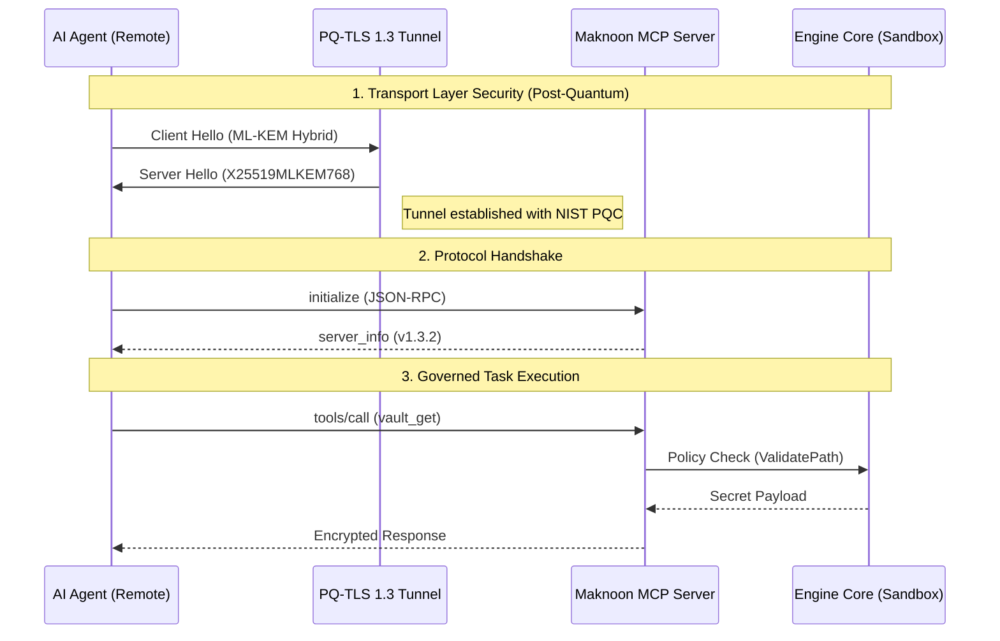

# AI Agent and Automation Integration
> **Standardized Cryptographic Interface for Autonomous Systems**

## Executive Summary
Maknoon is designed for seamless integration with autonomous systems, Large Language Models (LLMs), and AI agents. By implementing the **Model Context Protocol (MCP)** and providing a self-describing command schema, Maknoon enables agents to perform complex cryptographic operations within a governed, machine-readable environment.

---

## Model Context Protocol (MCP) Integration
Maknoon operates as a native MCP server, supporting both local and remote transport protocols.

### Dual-Transport Support

| Transport | Implementation | Primary Use Case |
| :--- | :--- | :--- |
| **Stdio** | Standard I/O streams. | Local integration with Cursor, VS Code, and Desktop agents. |
| **SSE** | Server-Sent Events (HTTPS). | Remote agentic microservices and cloud-native gateways. |

### SSE Transport Security (PQ-TLS 1.3)
Remote MCP sessions are secured using **Post-Quantum TLS 1.3**. This integration provides a significant Security ROI by protecting agent communications against "Store Now, Decrypt Later" (SNDL) attacks.



*   **Hybrid Key Exchange**: Combines `X25519` (classical) and `ML-KEM-768` (quantum-resistant).
*   **Authentication**: Server identities are validated using standard TLS certificates, with the option for PQC-signed client certificates in future releases.
*   **Zero-Configuration Safety**: The server defaults to the highest security parameters when `--tls-cert` and `--tls-key` are provided.

---

## Configuration Example (Claude Desktop)

### Local Stdio Mode
To register Maknoon for local use:

```json
{
  "mcpServers": {
    "maknoon": {
      "command": "maknoon",
      "args": ["mcp", "--transport", "stdio"],
      "env": {
        "MAKNOON_AGENT_MODE": "1"
      }
    }
  }
}
```

### Remote SSE Mode
To connect to a remote Maknoon gateway:

```json
{
  "mcpServers": {
    "maknoon-remote": {
      "command": "npx",
      "args": ["@modelcontextprotocol/client-sse", "https://maknoon.example.com/sse"]
    }
  }
}
```

---

## Launching the MCP Server

### Stdio Gateway (Default)
```bash
maknoon mcp
```

### Secure SSE Gateway
```bash
maknoon mcp --transport sse --address :8443 --tls-cert server.crt --tls-key server.key
```

---

## Automated Agent Handshake
Maknoon implements an automated detection mechanism to transition into machine-readable (JSON) output modes, ensuring compatibility with automated pipelines.

The engine activates **Agent Mode** when the following condition is met:
*   **Environment Variable**: `MAKNOON_AGENT_MODE=1` is explicitly set.
*   **Command Invocation**: The `mcp` command is executed (automatically sets `agent_mode=1`).

---

## Sandboxed Container Deployment
For maximum security in production AI environments, Maknoon should be deployed as a containerized sandbox. This provides process-level isolation, preventing an AI agent from accessing any sensitive data outside the explicitly mounted workspace.

### Docker Implementation
Maknoon utilizes a **multi-stage build** starting from an empty `scratch` image, resulting in a minimal (~13MB) container with **zero OS-level attack surface**.

```bash
# Launch a physically isolated sandbox with Stdio MCP
docker run -v ~/workspace:/home/maknoon -e MAKNOON_AGENT_MODE=1 maknoon-sandbox
```

### Filesystem Governance
When operating in a containerized sandbox, Maknoon enforces strict path validation:
*   **Permitted**: `/home/maknoon` (and subdirectories), `/tmp/maknoon`.
*   **Prohibited**: System directories, root-level sensitive paths, and dotfiles outside the workspace.

---

## Environment Configuration (Viper-Based)
The following variables govern the behavior of Maknoon in automated and non-interactive environments.

| Variable | Description |
| :--- | :--- |
| `MAKNOON_AGENT_MODE` | Activates structured JSON output and non-interactive prompts. |
| `MAKNOON_PASSPHRASE` | Supplies the master key for vault and identity unlocking. |
| `MAKNOON_PRIVATE_KEY` | Specifies the path to the primary private identity file. |
| `MAKNOON_PUBLIC_KEY` | Sets the default recipient path for encryption tasks. |

> **Note:** All environment variables are prefixed with `MAKNOON_` and map to configuration keys using underscores (e.g., `mcp.transport` maps to `MAKNOON_MCP_TRANSPORT`).

---

## Environment Configuration
The following variables govern the behavior of Maknoon in automated and non-interactive environments.

| Variable | Description |
| :--- | :--- |
| `MAKNOON_AGENT_MODE` | Activates structured JSON output and non-interactive prompts. |
| `MAKNOON_PASSPHRASE` | Supplies the master key for vault and identity unlocking. |
| `MAKNOON_PASSWORD` | Sets the default secret for credential management operations. |
| `MAKNOON_PRIVATE_KEY` | Specifies the path to the primary private identity file. |
| `MAKNOON_PUBLIC_KEY` | Sets the default recipient path for encryption tasks. |

## Tool Specification Reference
Maknoon is fully self-describing. AI Agents can query the current tool registry and schema dynamically to understand the available cryptographic capabilities.

```bash
# Generate human-readable tool documentation from schema
maknoon schema --format markdown > wiki/Tool-Reference.md
```

| Tool Name | Mission Role | Description |
| :--- | :--- | :--- |
| `vault_get` | Identity | Secure retrieval of agent credentials from the PQC vault. |
| `encrypt_file` | Protection | Multi-recipient Post-Quantum encryption of local assets. |
| `inspect_file` | Analysis | Forensic header analysis without private key access. |
| `config_update` | Governance | Dynamic live-migration of cryptographic profiles (Agility). |
| `p2p_send` | Transport | Direct peer-to-peer authenticated file transfer. |
| `gen_passphrase` | Logic | Provisioning of secure, high-entropy master mnemonics. |


---

## Governance & Compliance
