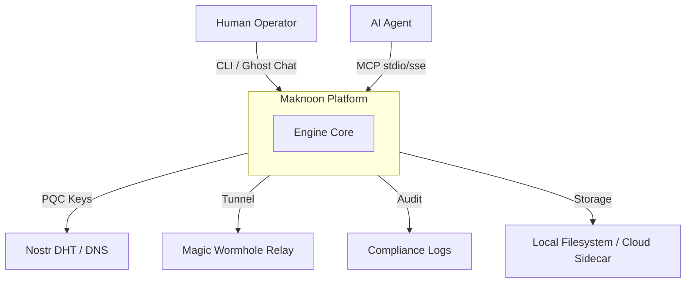
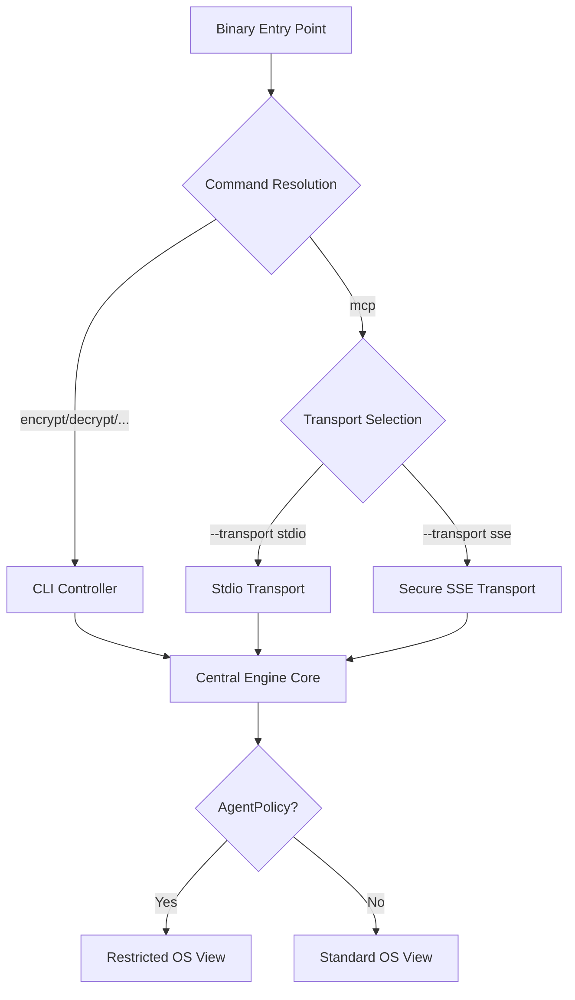
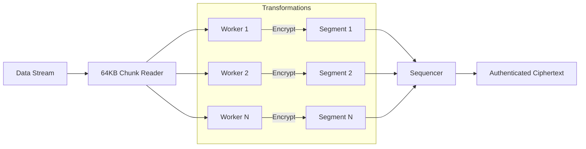
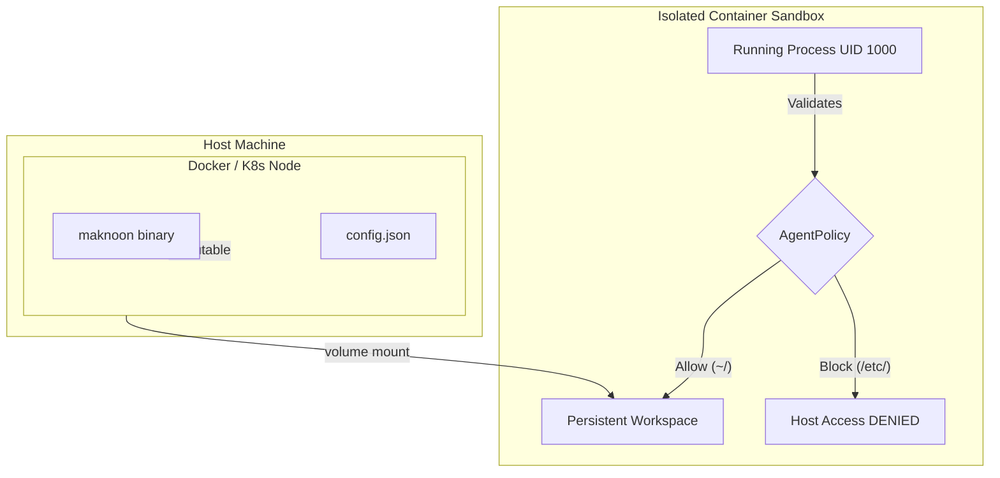

# Architectural Specification
> **Streaming-First Post-Quantum Cryptographic Engine**

## Executive Summary
Maknoon is architected as a high-performance, constant-memory cryptographic engine designed to mitigate both classical and quantum computational risks.

The system utilizes a modular streaming pipeline that decouples I/O operations from cryptographic transformations.

---

## Unified Binary Architecture
Starting with V3, Maknoon implements a **Unified Binary** design. A single statically linked binary hosts the CLI, the cryptographic engine, and the native Model Context Protocol (MCP) server.

*   **Logic Consolidation**: The core logic resides in `pkg/crypto/engine.go`, which is consumed by both the CLI and MCP layers.
*   **Reduced Attack Surface**: By eliminating external dependencies and shared libraries, the binary provides a consistent security posture across all operational modes.
*   **Mode Selection**: The mode of operation is determined by the command-line entry point (e.g., `maknoon mcp` for server mode vs. `maknoon encrypt` for CLI mode).

---

## Dual-Transport MCP
Maknoon supports the Model Context Protocol (MCP) via two distinct transport mechanisms, enabling both local and remote agent orchestration.

| Transport | Implementation | Use Case |
| :--- | :--- | :--- |
| **Stdio** | Standard Input/Output pipe. | Local integration with IDEs (Cursor, VS Code) and desktop agents. |
| **SSE** | Server-Sent Events over HTTPS. | Remote gateways and cloud-native agentic microservices. |

### Post-Quantum Transport Security
Remote SSE sessions are secured via **PQ-TLS 1.3**. The server utilizes Go 1.23's native support for the `X25519MLKEM768` hybrid key exchange, ensuring the transport layer itself is resilient against "harvest now, decrypt later" attacks.

---

## Core Streaming Pipeline
The architecture centers on a **Parallel Sequencer Model** that processes data in discrete segments.

| Component | Technical Function |
| :--- | :--- |
| **I/O Reader** | Ingests data in 64KB atomic blocks to maintain $O(1)$ memory complexity. |
| **Worker Pool** | Executes cryptographic transformations in parallel across available CPU cores. |
| **Sequencer** | Reassembles processed segments in deterministic order, ensuring strict file integrity. |
| **Transformer Middleware** | Modular layer for on-the-fly archival (TAR), compression, and encryption. |

---

## Industrial Sandbox Layout
For containerized deployments, Maknoon utilizes a zero-OS `scratch` build. This environment enforces a minimal filesystem layout required for secure operation.

| Path | Purpose | Permissions |
| :--- | :--- | :--- |
| `/usr/local/bin/maknoon` | The immutable unified binary. | Read-Only (Root) |
| `/home/maknoon` | Primary working directory and persistent storage. | Read/Write (UID 1000) |
| `/tmp/maknoon` | Ephemeral storage for transient operations. | Read/Write (UID 1000) |

---

## Cryptographic Design
Maknoon implements a hybrid cryptographic stack that combines NIST-standardized lattice-based algorithms with battle-tested elliptic curve cryptography.

### Hybrid Key Encapsulation (HPKE)
The system utilizes **HPKE (RFC 9180)** to wrap File Encryption Keys (FEKs). This implementation employs a composite KEM:
*   **Lattice Component**: ML-KEM-1024 (Kyber) providing quantum resistance.
*   **Elliptic Curve Component**: X25519 for classical security and performance.

### Context-Aware Security
All cryptographic operations are bound to the file's metadata via the HPKE `info` parameter. This binding includes `ProfileID` and `Header Flags`, effectively mitigating "Recipient Transplantation" and metadata-tampering attacks.

---

## Configuration Management (Viper)
V3 standardizes configuration using the **Viper** framework, providing a strict hierarchy for parameter resolution.

1.  **CLI Flags**: Immediate overrides provided during execution.
2.  **Environment Variables**: Prefixed with `MAKNOON_` (e.g., `MAKNOON_AGENT_MODE`).
3.  **Config File**: `config.json` or `.maknoon.yaml` in the user's home directory.
4.  **Defaults**: Hardcoded safe defaults within the engine.

---

## Testing Strategy
The V3 suite introduces a **Transport-Agnostic Mission** testing model.

*   **Mission Suites**: Tests verify engine behavior through high-level missions that run identically over CLI, Stdio-MCP, and SSE-MCP transports.
*   **Short Standardization**: Use of `testing.Short()` to skip network-intensive or hardware-bound (FIDO2) tests during rapid local iteration, while ensuring full coverage in CI/CD pipelines.
